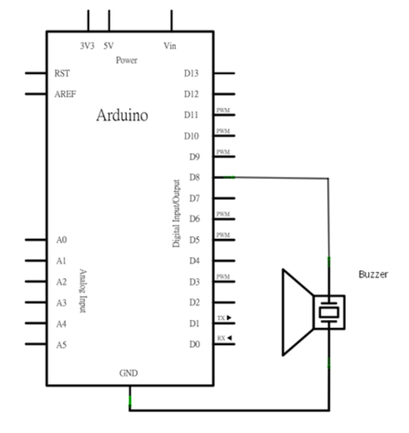

Pirates of the Caribbean tune in your Arduino buzzer
# Prerequisites

### Hardware
- *1 Arduino Board (I use Arduino Uno)
- *1 Arduino USB cable
- *1 BreadBoard
- *1 Passive Buzzer
- *2 jumping wires

### Software
- Arduino IDE
**_OR_**
* Visual Studio Code (with Arduino extension installed)

Arduino IDE has more beginner friendly layout for learning Arduino and C++ language.
However, its good practice to work with Visual Studio Code as most of the world works with it.

# Setup
Connect the circuit as shown in the diagram
> [!IMPORTANT]
> Make sure that the Jumping wire that connects Arduino GND is to the **_negative_** of the buzzer


After finishing setting it up it should look similar to the diagram below.
Just note the diagram show cases the Arduino Uno

Make sure your setup is aligned with the arduino board you are using, otherwise you'll have problem compiling the program.

Solutions to possible problems with IDE <=> Arduino setup:
- IDE isn't configured with the correct **Arduino Board**
- IDE isn't configured with the correct **Serial Port**

Those 2 issues above shouldn't be an issue as the IDE finds the Arduino type and serial port for you automatically when you connect the USB cable to the computer.
* Does the `.ino` file that runs arduino is the same name as in arduino.json configuration file. If you have an issue with that you can either rename the folder of the project or restart the Arduino IDE(usually fixes itself).

# Code
### Modification You Can Do
- Go to `include/Constant.h` file contains `BUZZER_IO` constant variable this is the port of arduino I/O that is connected to the Buzzer(Passive). **If you connect to a different port make sure to change that variable aligned to the port you connected**
- In the `include/Constant.h` file contains enum of the musical notes distributed in frequencies. If you want to **change** the frequencies you can head the __source__ file that I used [Musical Notes to Frequencies](https://pages.mtu.edu/~suits/notefreqs.html)
- There is a sound multiplier a variable that can multiply the frequency of the musical note. You can access it by editing the `CaribbeanTune` object in `arduino_caribbean_buzzer.ino` by adding additional __argument__ in the parenthesis
This will look something like this:
```
void setup()
{
  int frequencyMultiplier = 2;
  tuner = new CaribbeanTune(BUZZER_IO, frequencyMultiplier);
  pinMode(BUZZER_IO, OUTPUT); // sets up the port pin for the arduino to connect to the buzzer
}
```
### Arduino `built-in` Methods
Arduino library has a built-in method `tone()` that runs voltage in the frequency and duration that you pass in the arguments.
For more details about the method you can visit the arduino website here [Tone](https://www.arduino.cc/reference/en/language/functions/advanced-io/tone/)
The reason we use `tone` method is because thats the only built-in method in arduino that handles different frequencies compared to `analogWrite()` which is stuck in 500Hz frequency. [source](https://docs.arduino.cc/learn/microcontrollers/analog-output/)

The `delay()` method is required in the project because the `tone()` method runs on a different thread => which means that when you run `tone()` right after another they will be played simultaneously.
In the class `InstrumentBuzzer.h` the method `playNote()` solves that issue, so needn't worry about it.

**Anyways, thats all, Enjoy!**